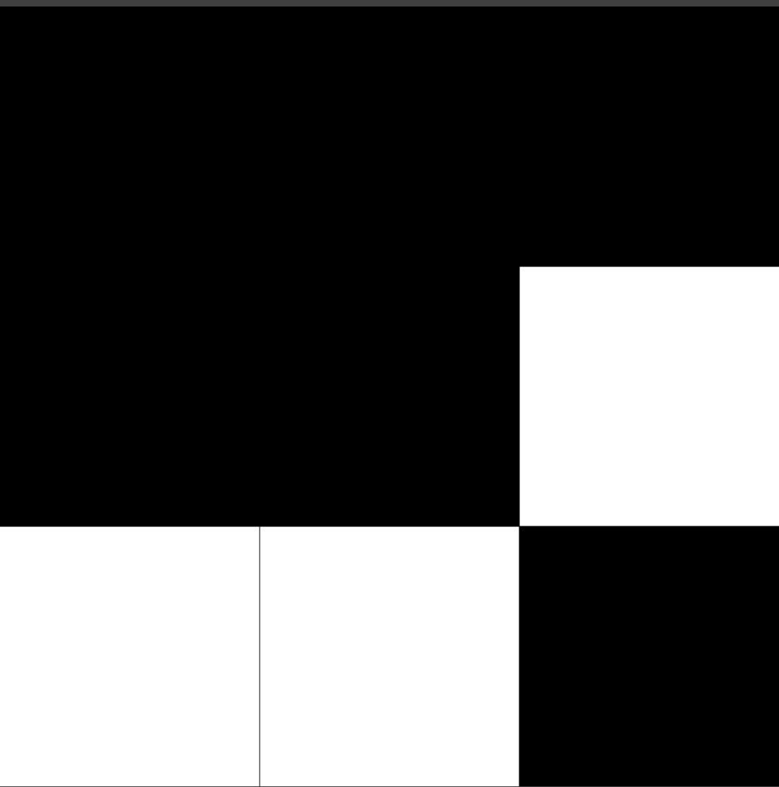

### Reversing the Game of Life

This project implements the Reverse Game of Life (Reverse GoL), which involves determining a previous state \( s' \) that evolves into a given state \( s \) after \( N \) steps of Conway’s Game of Life. Mathematically, this is expressed as \( next(s', N) = s \), where \( next(o, n) \) computes the state of the Game of Life after \( n \) steps starting from state \( o \), and \( N \) specifies the number of steps to reverse. This project provides two distinct models to address this problem, along with a web app for visualizing the process.

#### Overview of Conway's Game of Life
The Game of Life (GoL), created by John Conway, is a well-known cellular automaton that transitions states based on four simple rules:
1. Any live cell with fewer than 2 live neighbors dies.
2. Any live cell with more than 3 live neighbors dies.
3. Any live cell with 2 or 3 live neighbors remains alive.
4. Any dead cell with exactly 3 live neighbors becomes alive.

These rules make computing the next state straightforward: every state has a single successor, and a next state always exists. However, the reverse is not true: given a state \( s \), finding a previous state is not guaranteed, and there may be multiple possible predecessors. 

For example, the following 3x3 grid has no valid previous states because no configuration generates it:



Conversely, a completely blank grid (all cells dead) could have several predecessors, such as a blank grid or configurations with isolated cells that died.

#### Defining the Reverse GoL Problem
The Reverse GoL problem is the challenge of finding a state that, after \( N \) steps, evolves into a desired state \( s \), where \( N \) is defined by the user.

This problem is naturally combinatorial and can be addressed using constraint programming techniques. Two approaches can be considered:
1. **Full-sequence modeling:** Represent the entire sequence of \( N \) backward steps in a single model.
2. **Stepwise modeling:** Use a constraint model to compute one step back at a time and repeat the process \( N-1 \) times.

#### Stepwise Model and Solution Search
The stepwise model requires a strategy to explore the solution space due to the lack of guaranteed predecessors for any given state. This project employs a depth-first search (DFS) approach:
1. From a given state, the model generates all possible predecessors.
2. The search proceeds recursively with the first predecessor, continuing \( N-1 \) more times.
3. If a predecessor cannot be found, the search backtracks to explore the next possible state.

This exploration continues until either a valid solution is identified or all options are exhausted.

#### Eliminating Unnecessary Solutions
An additional constraint is added to simplify the search: if a 3x3 section of a state is entirely blank, the center cell could have been alive or dead in the previous state without affecting the outcome. To avoid generating redundant solutions, a rule ensures that if a cell has no living neighbors in the next state, it must also be dead in the previous state.

This constraint helps reduce the solution space by excluding scenarios where cells are too distant to interact meaningfully with others.

## Code 
The implementation uses [Minizinc](https://www.minizinc.org/) to model and solve the problem. There is also a python interface that allows to call the models via a web app and to write the DFS code needed for the single state model. 

### Execution
To launch the web app, install the python dependencies via ```pip -r requirements.txt``` and then execute the ```app.py``` script. The webpage will be available at https://localhost:5000.
